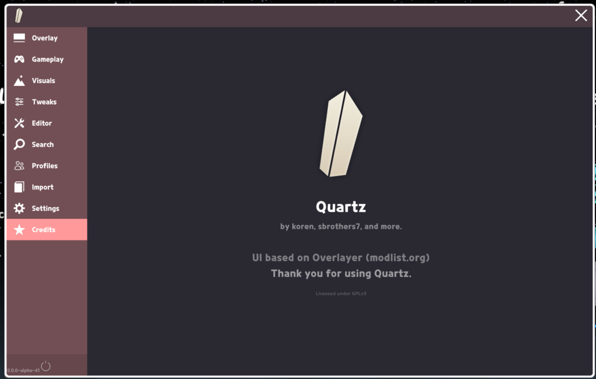

  <a href="README.md">🇺🇸 English</a> |
  <a>🇰🇷 한국어</a> |
  <a href="CREDITS.md">⭐️ Credits</a>

    

> [!NOTE]
> 릴리스에는 두 가지 빌드가 포함되어 있습니다. **`Quartz.zip`** 은 MelonLoader 빌드이고 (추천). **`QuartzUmm.zip`** 이 UnityModManager 빌드입니다 (이미 UMM을 사용하고 있을 시에만 이 빌드를 사용하는 것을 추천합니다). 두 빌드 모두 같은 인게임 uGUI 메뉴를 탑재하고 있으며 **UMM 전용 빌드는 IMGUI 설정 패널을 사용하지 않습니다**.

## 설치 — MelonLoader (추천)

> [!NOTE]
> 맥 사용자는 [딸깍설치기](https://github.com/sbrothers7/UMMInstall/releases/latest)를 통해 쉽게 설치할 수 있습니다.

0. [modlist.org app](https://github.com/modlist-org/modlist_org_app/releases/latest)과 [Quartz](https://github.com/QuartzTeam/Quartz/releases/latest) 다운로드
1. MelonLoader가 설치되어 있지 않다면, modlist.org app을 이용해 설치해주세요.
2. '파일에서 모드 설치' 아이콘 클릭 후 zip파일(Quartz.zip)을 선택하세요.
3. 끝!

> [!NOTE]
> 맥 사용자라면 modlist.org app에서 '설치 관리' 탭에서 '네이티브 시작 옵션 복사' 클릭 후 스팀 시작 옵션에 붙여넣어야 MelonLoader가 적용됩니다.

## 설치 — MelonLoader (수동)

0. MelonLoader가 설치되어 있는지 확인하세요 (그렇지 않다면: [추천](https://github.com/QuartzTeam/Quartz#install--melonloader-recommended))
1. [최신 릴리스](https://github.com/QuartzTeam/Quartz/releases/latest)에서 `Quartz.zip`을 다운로드 하세요.
2. 압축 해제 후 Quartz 폴더 안 항목을 얼불춤 폴더 안에 넣으세요 (맥OS 유저: 아래 경고문을 참고하세요).
3. 끝!

## 설치 — UnityModManager

0. UnityModManager가 얼불춤에 설치되어 있는지 확인하세요.
1. [최신 릴리스](https://github.com/QuartzTeam/Quartz/releases/latest)에서 `QuartzUmm.zip`을 다운로드 하세요.
2. UMM 앱에서 '모드 설치' 클릭 후 `QuartzUmm.zip`을 선택하거나 압축 해제 후 `Quartz` 폴더를 UMM 모드 폴더로 직접 이동하세요.
3. 끝! (인게임 메뉴는 지정된 단축키로 열 수 있으며 UMM 설정 화면에서는 접근할 수 없습니다).

> [!WARNING]
> 맥에서는 폴더 전체를 덮어 씌워버리기 때문에 각 파일을 수동으로 옮겨야 합니다.

## 스크린샷

<a href="https://www.star-history.com/?repos=QuartzTeam%2FQuartz&type=date&legend=top-left">
 <picture>
   <source media="(prefers-color-scheme: dark)" srcset="https://api.star-history.com/chart?repos=QuartzTeam/Quartz&type=date&theme=dark&legend=top-left" />
   <source media="(prefers-color-scheme: light)" srcset="https://api.star-history.com/chart?repos=QuartzTeam/Quartz&type=date&legend=top-left" />
   
 </picture>
</a>
